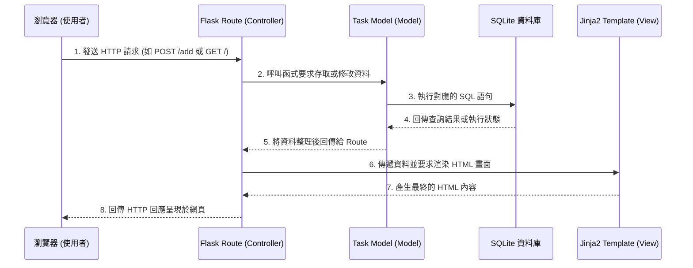

# 任務管理系統 - 系統架構設計 (Architecture)

## 1. 技術架構說明

本專案採用經典的 **MVC (Model-View-Controller)** 軟體設計模式，並基於 Python 的 Flask 微框架來建立輕量級 Web 應用。

*   **選用技術與原因：**
    *   **後端 (Flask):** Flask 輕巧且靈活，沒有過多的預設限制，適合快速開發 MVP (最小可行性產品) 與中小型專案。
    *   **模板引擎 (Jinja2):** 內建於 Flask，可直接在後端伺服器渲染 HTML 頁面，降低前後端分離帶來的 API 串接成本，非常適合初學者與快速驗證想法。
    *   **資料庫 (SQLite):** 輕量級的關聯式資料庫，無需安裝與維護額外的資料庫伺服器，所有資料儲存於單一檔案中，非常適合個人任務管理系統的規模。

*   **Flask MVC 模式說明：**
    *   **Model (模型):** 負責與 SQLite 資料庫互動，處理資料的儲存、讀取、更新與刪除（例如定義「任務」的資料表與結構）。
    *   **View (視圖):** 即 Jinja2 模板，負責呈現使用者介面 (HTML/CSS)，將後端傳來的任務資料動態顯示在網頁上。
    *   **Controller (控制器):** 即 Flask 路由 (`routes`)，負責接收使用者的請求 (如點擊「新增任務」或「刪除」按鈕)，呼叫 Model 處理對應資料，最後將結果丟給 View 去渲染更新後的頁面。

## 2. 專案資料夾結構

以下為建議的專案資料夾結構，將各個元件的職責清楚劃分：

```text
web_app_development/
├── app/                  # 應用程式主要資料夾
│   ├── models/           # 放置資料庫操作相關的程式碼 (Model)
│   │   └── task.py       # 處理任務 (Task) 的資料結構與資料庫 CRUD 邏輯
│   ├── routes/           # 放置 URL 路由與業務邏輯 (Controller)
│   │   └── task_routes.py# 處理新增、刪除、完成與篩選等請求
│   ├── templates/        # 放置所有的 HTML 頁面模板 (View)
│   │   ├── base.html     # 網站的共用版型 (標題、導覽列、頁尾等)
│   │   └── index.html    # 任務清單的主要畫面
│   └── static/           # 放置靜態資源 (CSS, JavaScript, 圖片)
│       ├── css/
│       │   └── style.css # 網站的主要樣式表
│       └── js/
│           └── script.js # 簡單的前端互動邏輯 (如需要)
├── instance/             # 存放本地特定或敏感資料 (通常不進入 Git)
│   └── database.db       # SQLite 資料庫檔案
├── docs/                 # 專案說明文件
│   ├── PRD.md            # 產品需求文件
│   └── ARCHITECTURE.md   # 系統架構設計文件 (本文件)
├── app.py                # 程式進入點，負責啟動 Flask 伺服器並註冊路由
└── requirements.txt      # 記錄專案所需的 Python 套件 (如 Flask)
```

## 3. 元件關係圖

以下展示了系統中各元件如何互動，完成一次使用者的操作請求：



## 4. 關鍵設計決策

1.  **不使用前後端分離架構：**
    *   *原因：* 為了快速開發與驗證功能，我們選擇讓伺服器直接透過 Jinja2 渲染 HTML。這免去了設計 RESTful API、處理跨域請求 (CORS) 以及維護兩個獨立專案 (前端與後端) 的複雜度。
2.  **採用 SQLite 而非 MySQL / PostgreSQL：**
    *   *原因：* 作為一個單人使用的任務管理系統，資料量不大且同時請求數低。SQLite 不需額外架設伺服器、零設定且檔案輕量，完全足以應付此需求，也方便後續的本地開發與快速測試。
3.  **分離 Model 與 Route (Controller)：**
    *   *原因：* 儘管專案目前很小，但將資料庫操作邏輯（`models`）與 HTTP 請求處理邏輯（`routes`）拆分，能保持程式碼職責單一 (Single Responsibility Principle)，不僅讓程式碼乾淨且易於維護，未來若要擴充其他實體 (例如「使用者管理」) 時，也不會讓核心程式變得過度臃腫。
