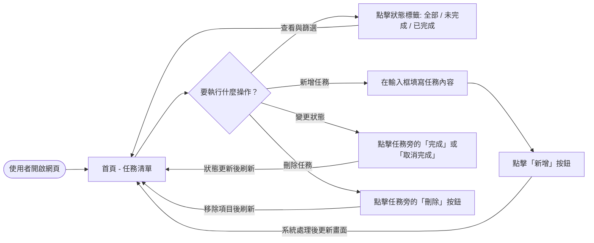
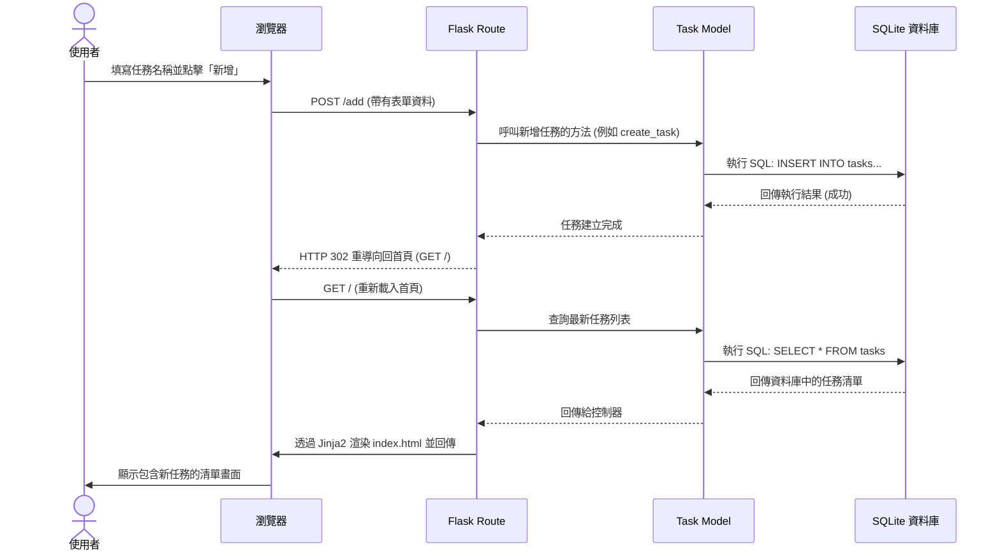

# 任務管理系統 - 流程圖設計 (Flowchart)

這份文件描述了使用者在任務管理系統中的操作路徑 (User Flow)，以及系統背後資料處理的序列圖 (Sequence Diagram)。

## 1. 使用者流程圖 (User Flow)

展示使用者進入網站後，可以進行的各種操作與對應的頁面變化。

## 2. 系統序列圖 (Sequence Diagram)

此處以「使用者新增任務」為例，展示從前端表單送出到後端存入 SQLite 資料庫的完整流程。

## 3. 功能清單對照表

將 PRD 中的主要功能對應至即將開發的 URL 路由與使用的 HTTP 方法：

| 功能名稱 | URL 路徑 | HTTP 方法 | 說明 |
| :--- | :--- | :--- | :--- |
| **顯示任務清單與篩選** | `/` | `GET` | 顯示首頁任務，並支援以 Query String (如 `/?status=completed`) 篩選。 |
| **新增任務** | `/add` | `POST` | 接收表單提交的任務標題，存入資料庫後重導向回首頁。 |
| **切換任務完成狀態** | `/toggle/<int:task_id>` | `POST` | 依據任務 ID 更新資料庫中的完成狀態 (未完成 $\leftrightarrow$ 已完成)。 |
| **刪除任務** | `/delete/<int:task_id>` | `POST` | 依據任務 ID 從資料庫中刪除該筆資料，並重導向回首頁。 |

> **備註：** 在傳統的 HTML 表單中通常只支援 GET 與 POST，因此更新 (toggle) 與刪除 (delete) 操作都會設計為 POST 請求。
